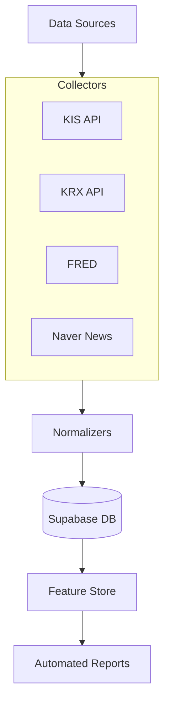

# 🚀 StockData Platform

StockData Platform은 한국투자증권(KIS) Open API 및 다양한 금융 데이터 소스를 통합하여, 퀀트 투자를 위한 정제된 데이터를 자동으로 수집 및 제공하는 엔드투어엔드 데이터 파이프라인입니다.

## 🌟 주요 특징

- **스마트 유니버스(Smart Universe)**: 시가총액, 거래량, 인덱스 구성 종목 등 6가지 동적 카테고리를 결합하여 최적의 수집 대상을 자동으로 선정합니다.
- **표준화된 KIS API**: 공식 SDK(`koreainvestment/open-trading-api`) 표준을 준수하며, 시세부터 공매도, 재무 지표까지 안정적으로 수집합니다.
- **Supabase 통합**: 모든 정규화된 데이터는 Supabase(PostgreSQL)에 적재되어 즉시 분석 및 백테스팅에 활용 가능합니다.
- **자동화된 워크플로우**: GitHub Actions를 통해 3시간 주기로 최신 금융 데이터를 자동 동기화합니다.

## 🏗 시스템 아키텍처



## 📊 데이터 카탈로그

| 카테고리 | 상세 테이블 명 | 주요 필드 |
| :--- | :--- | :--- |
| **국내 주식** | `normalized_stock_prices_daily` | 시고저종, 거래량, 거래대금 |
| **수급/공매도** | `normalized_stock_short_selling` | 공매도량, 과열종목정보 |
| **재무/지표** | `normalized_stock_fundamentals_ratios` | PER, PBR, ROE, 부채비율 |
| **거시 경제** | `normalized_global_macro_daily` | 환율, 금리, 원유, 해외지수 |

## 🛠 시작하기

### 1. 환경 변수 설정
`config/api_keys.json` 파일을 생성하거나 GitHub Secrets에 `API_KEYS_JSON`을 등록하십시오.

```json
{
  "kis": {
    "app_key": "YOUR_KEY",
    "app_secret": "YOUR_SECRET",
    "is_real": true
  },
  "supabase": {
    "url": "YOUR_URL",
    "service_role_key": "YOUR_KEY"
  }
}
```

### 2. 파이프라인 실행
```bash
# 전체 파이프라인 수동 실행
export PYTHONPATH="."
python src/jobs/run_daily_stock_pipeline.py
```

## 📜 라이선스
이 프로젝트는 개인 투자 분석용으로 제작되었으며, 상업적 이용 시 관련 라이선스를 확인하십시오.
