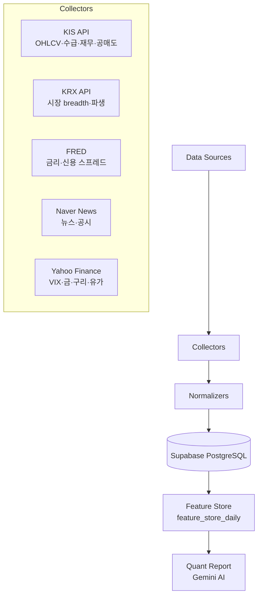

# 🚀 StockData Platform

한국 주식 시장 퀀트 투자를 위한 **엔드투엔드 데이터 파이프라인**. KIS Open API, FRED, KRX, Naver News 등 다양한 소스를 통합하여 정제된 Feature Store를 자동으로 구축합니다.

---

## 🌟 주요 특징

| 기능 | 설명 |
| :--- | :--- |
| **스마트 유니버스** | 시가총액·거래량·인덱스 구성 6가지 카테고리 동적 결합, 중복 자동 제거 |
| **3종 백필 엔진** | 신규 편입 종목 감지 시 OHLCV·수급·재무 30일치 자동 수집 |
| **배치 적재 엔진** | 1,000건 청크 분할 upsert (413 에러 방지), 200건 동적 Flush |
| **매크로 모멘텀** | `normalized_global_macro_daily`의 모든 수치 컬럼에 1d/5d 변화율 자동 생성 (하드코딩 Zero) |
| **CRITICAL 감시** | 파이프라인 종료 시 당일 데이터 0건 테이블 즉시 `CRITICAL` 로그 경보 |
| **자동화 워크플로** | GitHub Actions 매 **1시간** 실행 (KST `0분` 정각) |

---

## 🏗 시스템 아키텍처



---

## 📊 데이터 카탈로그

| 카테고리 | 테이블명 | 주요 필드 |
| :--- | :--- | :--- |
| **국내 주가** | `normalized_stock_prices_daily` | 시고저종·거래량·거래대금·`market_cap` |
| **투자자 수급** | `normalized_stock_supply_daily` | 외인·기관·연기금·개인 순매수 |
| **공매도** | `normalized_stock_short_selling` | 공매도량·잔고·비율 |
| **재무/지표** | `normalized_stock_fundamentals_ratios` | PER·PBR·ROE·부채비율·시가총액 |
| **글로벌 매크로** | `normalized_global_macro_daily` | USD/KRW·DXY·US10Y·WTI·금·구리·VIX |
| **매크로 시리즈** | `normalized_macro_series` | FRED 시리즈 (DGS10, BAMLH0A0HYM2 등) |
| **피처 스토어** | `feature_store_daily` | 이동평균·변동성·수급 Z-Score·매크로 모멘텀 |
| **시장 Breadth** | `market_breadth_daily` | 상승/하락 종목 수·등락비율 |

---

## ⚙️ 파이프라인 구성

```
run_daily_macro_pipeline.py   ← FRED/Yahoo/KRX 매크로 수집
run_daily_derivatives_pipeline.py ← KOSPI200 선물·파생 수집
run_daily_stock_pipeline.py   ← 종목별 OHLCV·수급·재무 수집 + 백필
run_daily_feature_pipeline.py ← Feature Engineering (피처 스토어 갱신)
```

### 신규 종목 자동 백필 흐름

```
종목 처리 시작
    └─ DB 과거 데이터 < 20일?
        ├─ YES: fetch_ohlcv (30일) ─→ price_buf
        │       fetch_investor_trend  ─→ supply_buf (sleep 0.2s)
        │       fetch_fundamental_info ─→ ratio_buf (sleep 0.2s)
        │       버퍼 ≥ 200건? → 즉시 Flush
        └─ NO: 당일 데이터만 수집
```

---

## 🛠 시작하기

### 1. 환경 변수 설정

`config/api_keys.json` 생성 또는 GitHub Secrets `API_KEYS_JSON` 등록:

```json
{
  "kis": { "app_key": "YOUR_KEY", "app_secret": "YOUR_SECRET", "is_real": true },
  "supabase": { "url": "YOUR_URL", "service_role_key": "YOUR_KEY" },
  "fred": { "api_key": "YOUR_KEY" },
  "opendart": { "api_key": "YOUR_KEY" },
  "naver": { "client_id": "YOUR_ID", "client_secret": "YOUR_SECRET" }
}
```

### 2. 수동 실행

```bash
export PYTHONPATH="."

# 매크로 수집
python src/jobs/run_daily_macro_pipeline.py

# 주식 수집 (전체)
python src/jobs/run_daily_stock_pipeline.py

# 피처 생성
python src/jobs/run_daily_feature_pipeline.py

# 특정 날짜 지정
python src/jobs/run_daily_stock_pipeline.py --date 20260416

# 빠른 검증 (5개 종목만)
python src/jobs/run_daily_stock_pipeline.py --limit 5
```

### 3. GitHub Actions 자동화

`.github/workflows/daily_sync.yml` — **매 1시간** 자동 실행 (UTC `0분` 정각, KST 기준 `9시~24시` 전 구간 포함).

---

## 🔍 핵심 설계 원칙

- **`_parse_int` / `_parse_float`**: None·빈 문자열·콤마 포함 비정규 값 → 0 안전 변환
- **매크로 ffill → bfill**: 한/미 휴장일 차이로 발생하는 Null을 시계열 보정
- **inf / -inf 치환**: 변화율 계산 시 0 나눗셈 결과를 `np.nan` 처리 후 `isfinite` 검사
- **CRITICAL 감시**: 파이프라인 말미에서 4개 핵심 테이블의 당일 데이터 존재 여부 자동 검사

---

## 📜 라이선스

이 프로젝트는 개인 투자 분석용으로 제작되었으며, 상업적 이용 시 관련 라이선스를 확인하십시오.
